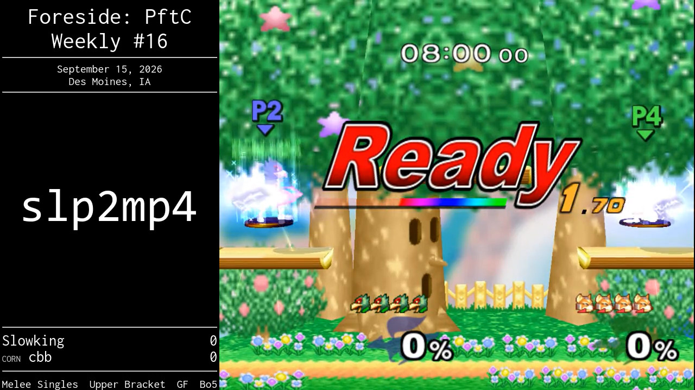
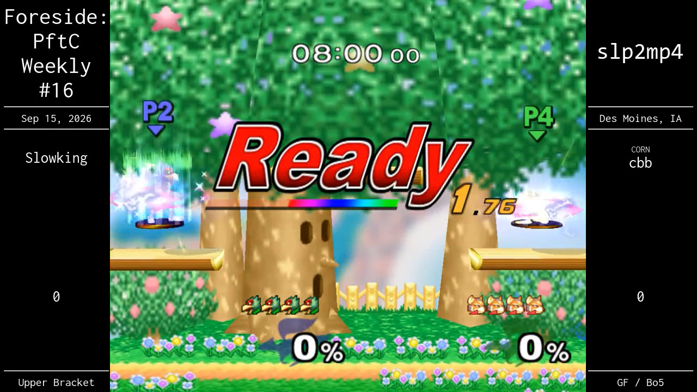
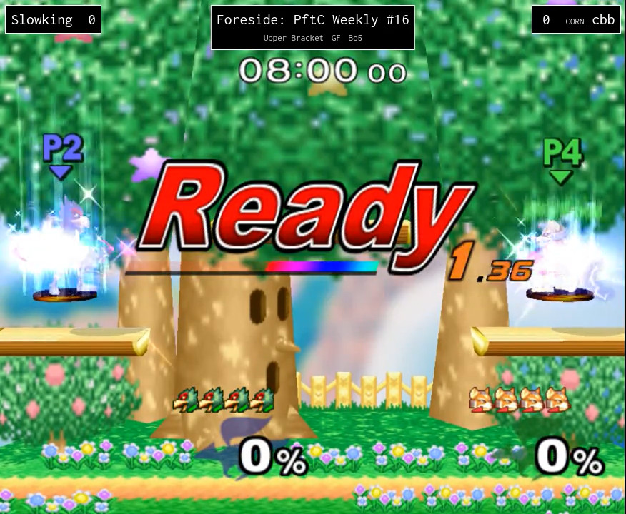
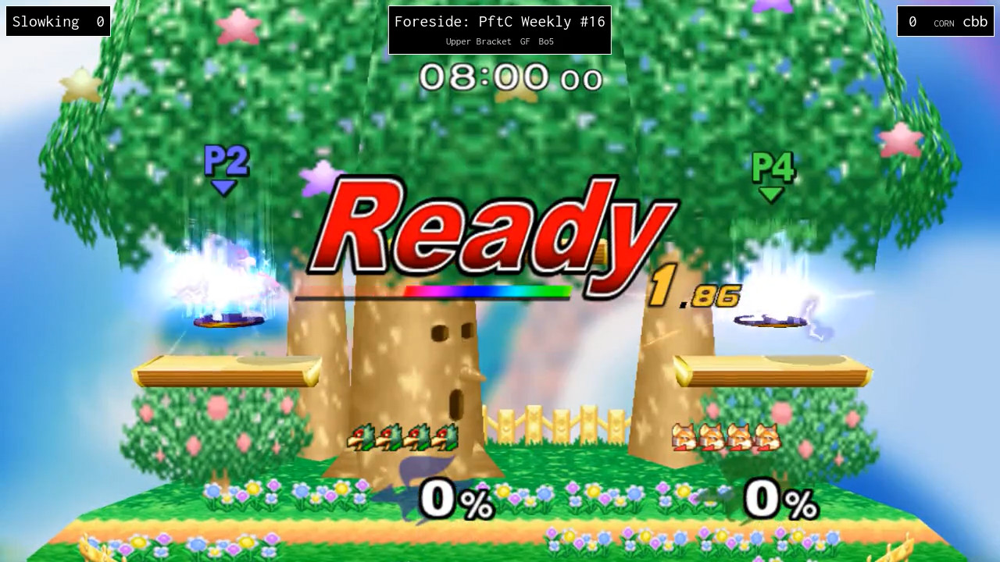

# `slp2mp4`

Convert Slippi replay files (`.slp`) to video files (`.mp4`) with ease.

## Features

- Parallel processing for faster conversions
- GUI for easy configuration and operation
- Customizable output resolution and bitrate
- Optionally combine all videos for easier upload
- Optionally generate scoreboards
- Cross-platform support for Windows, Linux
    - Dolphin on Mac does not support framedumping

## Requirements

- Python 3.11 or higher
- [FFmpeg](https://ffmpeg.org/) and `ffprobe` installed and accessible
- [Slippi Dolphin](https://slippi.gg/downloads) installed
- Super Smash Bros. Melee ISO file

## Installation

### From a Build

Select the latest release from the [releases][releases] page.

### From Source

```bash
pip install "slp2mp4[gui] @ git+https://github.com/davisdude/slp2mp4.git"
```

or

```bash
git clone https://github.com/davisdude/slp2mp4.git
pip install .[gui]
```

Both methods require having `git` and `pip` installed

## Usage

### Command Line Interface

```text
usage: slp2mp4 [-h] [-v] [-n] [-m] [-t TEMPORARY_DIRECTORY] [-o OUTPUT_DIRECTORY] [--debug] [--paths-ffmpeg PATHS_FFMPEG]
               [--paths-slippi-playback PATHS_SLIPPI_PLAYBACK] [--paths-ssbm-iso PATHS_SSBM_ISO] [--paths-ffprobe PATHS_FFPROBE]
               [--dolphin-backend {D3D12,DX11,DX9,OGL,Software Renderer,Vulkan}] [--dolphin-resolution {480p,720p,1080p,1440p,2160p}]
               [--dolphin-msaa DOLPHIN_MSAA] [--dolphin-ssaa | --no-dolphin-ssaa] [--dolphin-bitrate DOLPHIN_BITRATE]
               [--dolphin-gecko-codes DOLPHIN_GECKO_CODES] [--ffmpeg-audio-args FFMPEG_AUDIO_ARGS] [--ffmpeg-volume FFMPEG_VOLUME]
               [--runtime-parallel RUNTIME_PARALLEL]
               [--runtime-preserve-directory-structure | --no-runtime-preserve-directory-structure]
               [--runtime-youtubify-names | --no-runtime-youtubify-names] [--runtime-name-replacements RUNTIME_NAME_REPLACEMENTS]
               [--runtime-combine-mode {None,All,By Input,By Phase}] [--runtime-use-context-json | --no-runtime-use-context-json]
               [--runtime-exclude-streamed-sets | --no-runtime-exclude-streamed-sets]
               inputs [inputs ...]

positional arguments:
  inputs

options:
  -h, --help            show this help message and exit
  -v, --version         show program's version number and exit
  -n, --dry-run         Don't actually render videos; useful for testing
  -m, --monitor         Continuously watch input directories
  -t, --temporary-directory TEMPORARY_DIRECTORY
                        Where to write temp videos; leave blank for system default
  -o, --output-directory OUTPUT_DIRECTORY
                        Where to write output videos
  --debug
  --paths-ffmpeg PATHS_FFMPEG
  --paths-slippi-playback PATHS_SLIPPI_PLAYBACK
  --paths-ssbm-iso PATHS_SSBM_ISO
  --paths-ffprobe PATHS_FFPROBE
  --dolphin-backend {D3D12,DX11,DX9,OGL,Software Renderer,Vulkan}
  --dolphin-resolution {480p,720p,1080p,1440p,2160p}
  --dolphin-msaa DOLPHIN_MSAA
  --dolphin-ssaa, --no-dolphin-ssaa
  --dolphin-bitrate DOLPHIN_BITRATE
  --dolphin-gecko-codes DOLPHIN_GECKO_CODES
  --ffmpeg-audio-args FFMPEG_AUDIO_ARGS
  --ffmpeg-volume FFMPEG_VOLUME
  --runtime-parallel RUNTIME_PARALLEL
                        Max # of slippi instances; 0 = # of logical CPU cores
  --runtime-preserve-directory-structure, --no-runtime-preserve-directory-structure
                        Recreate input directory structure instead of being 'flat'
  --runtime-youtubify-names, --no-runtime-youtubify-names
                        Enable name replacements
  --runtime-name-replacements RUNTIME_NAME_REPLACEMENTS
                        Mapping of characters to replace in video titles
  --runtime-combine-mode {None,All,By Input,By Phase}
                        How to combine set videos; None = separate sets
  --runtime-use-context-json, --no-runtime-use-context-json
                        Use context.json files (if found) when naming / sorting videos
  --runtime-exclude-streamed-sets, --no-runtime-exclude-streamed-sets
                        Exclude sets marked with stream metadata (requires context.json)
```

### Graphical User Interface

The GUI has all the features that the CLI has. Change your settings in the
menu, set your input files and directories, then click start.

To launch the GUI, run `slp2mp4_gui`.

## Configuration

`slp2mp4` uses hierarchical settings that come from [TOML][toml] files.
Settings not found in the user configuration (`~/.slp2mp4.toml`) fall back to
the [default settings](#default-settings).

### Default Settings

The default settings can be found [here][default-settings].

### Configuration Options

#### Paths

- `ffmpeg`: Path to FFmpeg executable
- `ffprobe`: Path to ffprobe executable; if blank, an attempt is made to find it
- `slippi_playback`: Path to playback Slippi Dolphin executable
- `ssbm_iso`: Path to your Melee ISO file

#### Dolphin Settings

- `backend`: Video backend (`D3D12`, `DX11`, `DX9`, `OGL`, `Software Renderer`,
  `Vulkan`)
- `resolution`: Output resolution (`480p`, `720p`, `1080p`, `1440p`, `2160p`)
- `bitrate`: Video bitrate in kbps
- `msaa` / `ssaa`: Options for changing anti-aliasing; valid values vary based
  on selected backend
- `custom_gecko_codes`: A single string of all custom gecko codes to use. All
  will be enabled. Remove any `=` from the name.

##### Gecko Codes

- `"$Optional: Show Player Names"`
- `"$Optional: Game Music OFF"`
- `"$Optional: Widescreen 16:9"`
- `"$Optional: Disable Screen Shake"`
- `"$Optional: Hide HUD"`
- `"$Optional: Hide Waiting For Game"`
- `"$Optional: Enable Develop Mode"`
- `"$Optional: Lagless FoD"`

#### FFmpeg Settings

- `audio_args`: FFmpeg audio processing settings
- `volume`: Volume of dolphin (0-100)

#### Runtime Settings

- `parallel`: Number of parallel processes (0 = auto-detect CPU cores)
- `preserve_directory_structure`: Make video outputs match the input structure
  instead of being "flat"
- `youtubify_names`: Enable `name_replacements` (below)
- `name_replacements`: A mapping of characters to replace in titles; intended for
  uploads to websites (e.g. YouTube) that remove or prohibit certain characters
  in titles

    - To disable entirely, set `youtubify_names` to `false`
    - To disable for specific characters, have its assignment be to itself, e.g.

      ```toml
      [runtime.name_replacements]
      "-" = "-"
      ```

    - Replacements are only per-character. Replacing a single character with
      multiple characters or vice-versa may result in unexpected behavior.

- `combine_mode`: How to combine videos (`None`, `All`, `By Input`, `By Phase`)

    - Note that `By Phase` does not work properly without `context.json` files

- `use_context_json`: Use `context.json` files (if found) for file names / ordering
- `exclude_streamed_sets`: Use `context.json` to exclude files marked for stream

#### Scoreboard Settings

- `type`: Type of scoreboard (`None`, `Shared`, `Split`, `Minimal`, `Custom`)

##### Shared Scoreboard

A scoreboard where all the info is in one block. Does not support widescreen.

- `logo`: Path to logo; defaults to `slp2mp4` logo
- `left`: Whether scoreboard should be on the left or right



##### Split Scoreboard

A scoreboard where the gameplay is cenetered and info is on either side. Does
not support widescreen.

- `logo`: Path to logo; defaults to `slp2mp4` logo



##### Minimal Scoreboard

A minimalistic scoreboard. Supports widescreen.

No settings.





##### Custom Scoreboard

Allows for custom scoreboards. Uses [jinja][jinja] for templating. See
[templates][templates] for examples.

- `alignment`: ffmpeg [pad filter][pad-filter] x/y settings; controls video
  position
- `ratio`: Desired output aspect ratio; if blank, use input aspect ratio
- `html_path`: Path to the HTML template file
- `css_path`: Path to the CSS template file

### Example Configuration

Windows:

```toml
[paths]
ffmpeg = "~/Downloads/ffmpeg-2025-01-27-git-959b799c8d-essentials_build/bin/ffmpeg.exe"
slippi_playback = "~/AppData/Roaming/Slippi Launcher/playback/Slippi Dolphin.exe"
ssbm_iso = "~/Documents/iso/ssbm.iso"

[dolphin]
backend = "D3D12"
resolution = "1080p"
bitrate = 16000

[ffmpeg]
volume = 25

[runtime]
parallel = 0
```

Linux:

```toml
[paths]
ffmpeg = "ffmpeg"
slippi_playback = "~/.config/Slippi Launcher/playback/Slippi_Playback-x86_64.AppImage"
ssbm_iso = "~/Games/Melee.iso"

[dolphin]
backend = "OGL"
resolution = "1080p"
bitrate = 16000

[ffmpeg]
volume = 25

[runtime]
parallel = 0
```

## Notes

* If you get weird looking video (where half the width is cropped), try
  changing the video backend (see `backend` in [dolphin
  settings](#dolphin-settings) for possible options).

    * This also applies to other graphical abnormalities, such as textures
      appearing in the wrong place

* Does not play nicely with WSL, since dolphin expects all paths to be relative
  to Windows.

* By default, Dolphin's video output does not exactly match the requested
  resolution. Instead, the output size is the first resolution beyond the
  requested resolution.

    * Videos are shrunk down to the expected resolution for scoreboard
      generation, as this improves render times and requires re-muxing the
      video anyways.

* If generated scoreboards have extra space at the bottom, try the
  dependencies-included build, which has a version of Chrome included that
  should work better. See [here][chrome-bug] for more.

## Tests

* `pytest` is required for running all tests
* Unit tests can be run stand-alone
* Integration tests require Dolphin, `ffmpeg`, `ffprobe`, and a melee `.iso`.

## License

This project is licensed under the MIT License - see the [license](LICENSE.md)
file for details.


[chrome-bug]: https://issues.chromium.org/issues/405165895
[default-settings]: ./src/slp2mp4/defaults.toml
[dolphin-video-backends-src]: https://github.com/dolphin-emu/dolphin/tree/master/Source/Core/VideoBackends
[dolphin-video-backends]: https://wiki.dolphin-emu.org/index.php?title=Configuration_Guide#Video_Backend
[jinja]: https://jinja.palletsprojects.com/en/stable/
[pad-filter]: https://ffmpeg.org/ffmpeg-filters.html#pad-1
[releases]: ../../releases
[replay-manager]: https://github.com/jmlee337/replay-manager-for-slippi
[templates]: slp2mp4/templates/
[toml]: https://toml.io/en/
